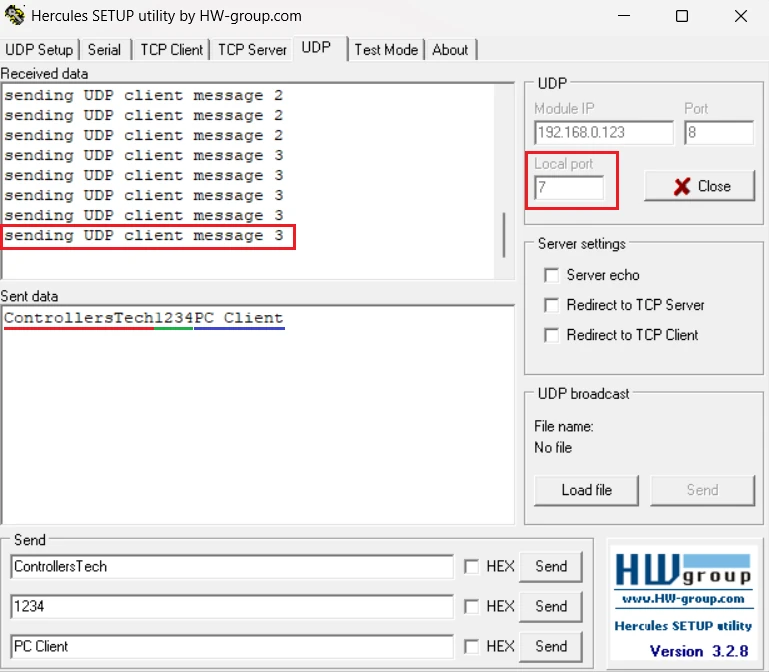

# STM32 Ethernet – UDP Client (Raw API)
This project demonstrates how to implement a **UDP Client** on STM32 using the LWIP Raw API. The STM32 acts as the initiating side — it connects to an external UDP server (e.g. Hercules on a PC), sends a numbered message every second using a hardware timer, and receives replies via a callback.

This is **Part 3** of the STM32 Ethernet (LWIP) series.

---

## Features Covered

- Creating a UDP PCB with `udp_new()`
- Binding to the STM32's local IP and port with `udp_bind()`
- Connecting to the remote server with `udp_connect()`
- Sending the first message immediately on connect
- Registering a receive callback with `udp_recv()`
- Handling incoming server replies in `udp_receive_callback()`
- Sending periodic UDP packets using a hardware timer (`HAL_TIM_PeriodElapsedCallback`)
- Proper pbuf memory management with `pbuf_alloc()` and `pbuf_free()`

---

### UDP Client vs UDP Server

| Role | Who Initiates | STM32 Use Case |
|-------|--------|-----------|
| UDP Server | Waits for client to send first | STM32 receives commands from a PC |
| UDP Client | STM32 reaches out to server | STM32 sends sensor data to a PC/server |

---

## Tested On

| Board | Series | Interface |
|-------|--------|-----------|
| Nucleo F207ZG | F2 | RMII |
| Discovery F7508 | F7 | RMII |
| Discovery H745 | H7 | MII |

The CubeMX and LWIP configuration is identical to Part 1 of this series. Refer to the `hardware-ping` README for full hardware and CubeMX setup details.

---

## IP Address Configuration

| Device | IP Address | Port |
|-------|--------|-----------|
| STM32 | `192.168.0.123` | `8`(local) |
| PC / Server | `192.168.0.100` | `7`(destinatoin) |

---

## How It Works
```c
1. udp_new()         -> Create UDP control block
2. udp_bind()        -> Bind to STM32 IP and local port 8
3. udp_connect()     -> Point PCB at server IP and port 7
4. udpClient_send()  -> Send first message immediately
5. udp_recv()        -> Register callback for incoming replies
6. [Timer ISR]       -> Fires every 1 second -> calls udpClient_send()
7. [Callback fires]  -> Server reply arrives -> copy data, increment counter
```
---

## Key Code
### Connect to the Server
```c
struct udp_pcb *upcb;

void udpClient_connect(void)
{
    upcb = udp_new();

    ip_addr_t myIPaddr;
    IP_ADDR4(&myIPaddr, 192, 168, 0, 123);
    udp_bind(upcb, &myIPaddr, 8);

    ip_addr_t DestIPaddr;
    IP_ADDR4(&DestIPaddr, 192, 168, 0, 100);
    err_t err = udp_connect(upcb, &DestIPaddr, 7);

    if (err == ERR_OK)
    {
        udpClient_send();
        udp_recv(upcb, udp_receive_callback, NULL);
    }
}
```

### Receive Callback
```c
char buffer[100];
int counter = 0;

void udp_receive_callback(void *arg, struct udp_pcb *upcb, struct pbuf *p,
                           const ip_addr_t *addr, u16_t port)
{
    strncpy(buffer, (char *)p->payload, p->len);
    counter++;
    pbuf_free(p);  // Always free
}
```

### Periodic Send via Timer
```c
void HAL_TIM_PeriodElapsedCallback(TIM_HandleTypeDef *htim)
{
    udpClient_send();
}

static void udpClient_send(void)
{
    struct pbuf *txBuf;
    char data[100];
    int len = sprintf(data, "sending UDP client message %d", counter);

    txBuf = pbuf_alloc(PBUF_TRANSPORT, len, PBUF_RAM);
    if (txBuf != NULL)
    {
        pbuf_take(txBuf, data, len);
        udp_send(upcb, txBuf);
        pbuf_free(txBuf);  // Always free
    }
}
```

### main.c
```c
int main(void)
{
    MPU_Config();
    SCB_EnableICache();
    SCB_EnableDCache();
    HAL_Init();
    SystemClock_Config();
    MX_GPIO_Init();
    MX_LWIP_Init();

    HAL_TIM_Base_Start_IT(&htim6);
    udpClient_connect();

    while (1)
    {
        MX_LWIP_Process();
    }
}
```
---

## Result

The image below shows the STM32 sending periodic messages to the Hercules UDP server and receiving replies:



---

## Common Errors & Fixes

| Symptom | Likely Cause | Fix |
|---------|-------------|-----|
|Receive callback never fires|PC firewall blocking UDP|Disable firewall; server must send to 192.168.0.111:8|
|Sends work but no replies|Server targeting wrong port|Server must target port 8|
|Communication stops after a few messages|pbuf_free() missing|Always free both Tx and Rx pbufs|
|pbuf_alloc() returns NULL|Memory pool exhausted|Increase LWIP heap in CubeMX or fix a pbuf leak|
|Timer fires but nothing sent|Timer interrupt not started|Call HAL_TIM_Base_Start_IT() before main loop|

---

## Full Tutorial and Explanation

Step-by-step explanation, CubeMX screenshots, and video walkthrough available at:

👉 https://controllerstech.com/stm32-ethernet-3-udp-client/

---

## Related Tutorials

| Part | Topic | Link |
|------|-------|------|
| Part 1 | Hardware Setup, LWIP & Ping Test | https://controllerstech.com/stm32-ethernet-hardware-cubemx-lwip-ping/ |
| Part 2 | UDP Server | https://controllerstech.com/stm32-ethenret-2-udp-server/ |
| Part 4 | TCP Server | https://controllerstech.com/stm32-ethernet-4-tcp-server/ |
| Part 5 | TCP Client | https://controllerstech.com/stm32-ethernet-5-tcp-client/ |
| Part 6 | HTTP Web Server (Simple) | https://controllerstech.com/stm32-ethernet-6-http-webserver-simple/ |
| Part 7 | UDP Server using NETCONN (RTOS) | https://controllerstech.com/udp-server-using-netconn-with-rtos-in-stm32/ |

---

## License
This example is provided for educational purposes under Controllerstech Guidelines.
